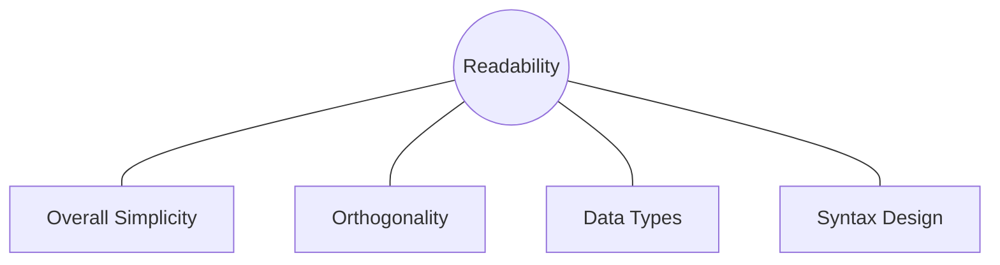
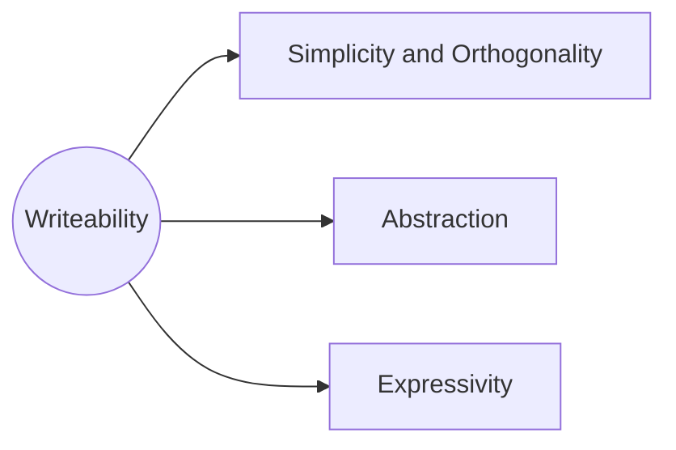
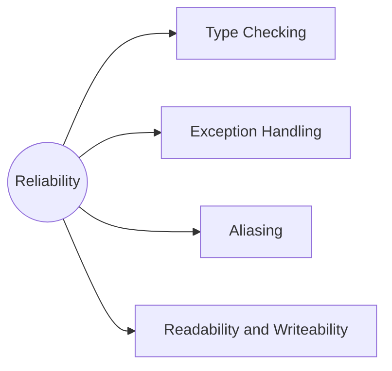

# L2-PPL  
## Domains of software
- Scientific
    - Fortran - Formula Translation
- Business Oriented
    - COBOL - Common Business Oriented Language
- Artificial Intelligence
    - LISP - List Processing
- System Software
    - C
- Web based
    - PHP JS etc.

## Qualities of a programming language
### 1. Readability

- Overall simplicity
    - Self explanatory
- Orthogonality 
    - You should have small number of constructs and small number of ways to combine them to write complex programs
- Data Types 
    - Some languages have richer data types than others
    eg: C & java
- Syntax Design
    - Simple keywords

### 2. Writeability 

Abstraction:
 - Focus on some DS, and you can abstract out the concept
 - if the code doesn't have such a support 
  (e.g. Language supports a abstraction like a stack)
Simplicity and Orthogonality:
 - Don't misuse too many features

### 3. Reliability

- Type checking
- Exception Handling
- Aliasing 
   - using different names for the same memory location
   - Leads to complications
- Readability and Writability

### 4. Cost
- Training
- Creating SW
- Compilation Cost 
    - (compilers can be paid)
- Execution Cost
- Language Implementation Systems 
    - (some VMs etc. JVM Is free but others can be paid)
- Poor reliability
- Maintenance

## What influences the languge design?
1. Computer architecture
    - Major influence on design of PLs
    - Most prevalent arch is Von Neumann (1940s)
    - Memory separated from processor, stores both code and data
    - Fetch, Decode, Execute, (Store?) Cycle
    - Eg. Parallel execution incorporate this

2. Programming Design Methodologies
    1. Procedural paradigm: Code is acting on data
        - Imperative languages
    2. Functional paradigm of languages:
        - A computation is applying functions which take parameters, no variables
    3. Logical Language
        - Rules are defined, order doesn't exist
        - (NuSMV)?
    4. Object Oriented paradigm : 
        - Data allows code to access it, or allows the access to the code (public/private methods/members)
    5. Scripting languages:
        - JS/PHP/ Python to some extent
    6. Markup
        - Add additional information to describe how the content will be displayed
        - XML / HTML / Markdown
    - Concurrenct programming

## Language Design Tradeoff
  1. Writeability and Reliability
      - pointers and large number of operators
  2. Reliability vs cost of exectution
      - C doesn't have an array bounds check
  3. Compilation cost vs Execution Cost
      - Do at Compile-time vs runtime
  
## Compile Implementation methods
  1. Compiler
  2. Interpreter
  3. Hybrid
  4. Preprocessor

