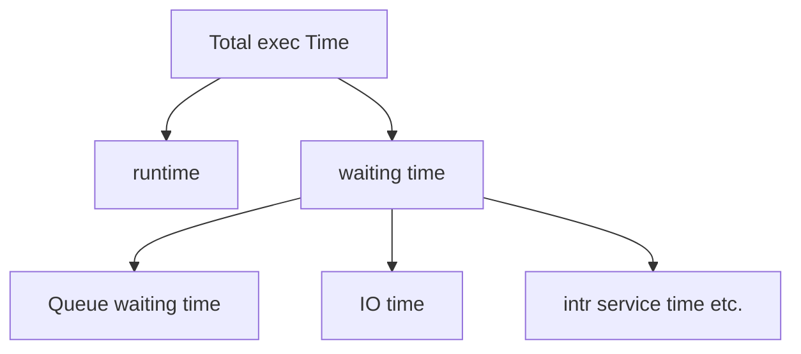
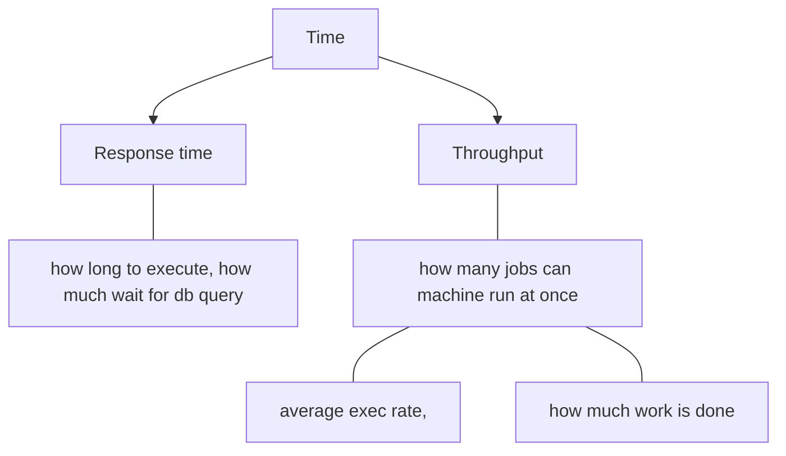

# L3 CompArch
## Why? 
- Design better programs, including system software such as compilers, Operating Systems, and device drivers
- Optimize Program behavior
- Evaluate (benchmark) computer system performance
- Understand time, space and price tradeoff
    >  you don't need a server for a Hello world program

## Comparch or comp organisation

### Organisation
- physical aspects of computer systems
- Circuit designs, control signals, memory types etc.
- How does a computer work
### Computer Architecture
  - Logical aspects of system as seen by the programmer
  - Instruction sets, formats, data types, addressing modes
  - How do I design a computer

Both go Hand-in-hand, and both are needed for requirements

### Instruction set design

Class of ISAs
  - Register - memory (x86) 
  - Load-Store ISAs (ARM/MIPS) [all operands have to be in the register]
    > aka register- register arch
  - PMD = Personal Mobile device
  

Computer arch - deals with functional architecture
  - Comparch = ISA + Machine Organization

Introduction - Performance
  - understand Underlying motivation for hw and its organization
  - Measure report and summarize performance
    - make intelligent choices
    - see through marketing hype
  - Depends on user requirements
  - How can we measure our performance and arrive with data?

We focus only on runtime for now, i.e. once the job is submitted to the CPU.

Does faster response time mean faster throughput?
Sir says yes, and wants a counterargument.

