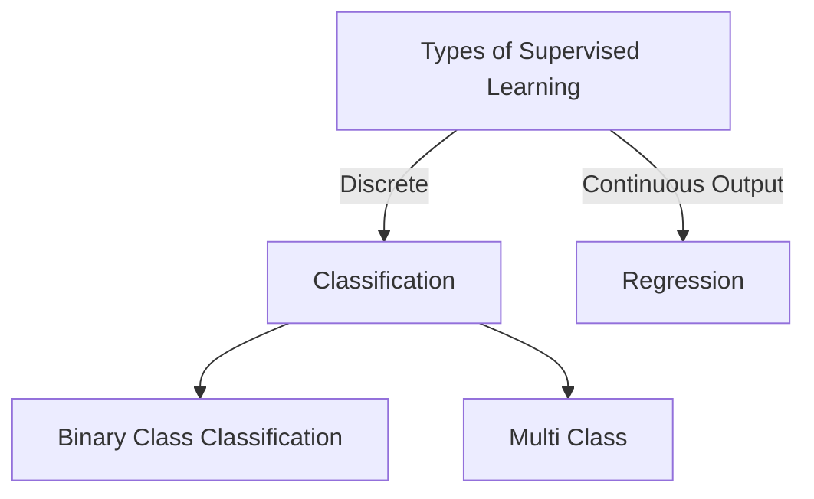

# L3 - NNFL



Input Instace -- Feature vector
Eg:

| Living Area (ft^2) | bedrooms | price |
| ------------------ | -------- | ----- |
| 2104               | 3        | 400   |
| 1600               | 2        | 160   |
| ..                 | ..       | ..    |

Each row is a feature vector

Hypothesis:
A hypothesis is a function that is used predict your output  
$h_w(\bold x) = w_0 + w_1x_1 + w_2x_2$

$x$ is an input matrix of nxm:
$x = \left[\begin{array}{cc} \left[\begin{array}{cc}x_0^0\\ ..\\x_n^0 \end{array} \right] & .. &\left[\begin{array}{cc}x_0^m\\ ..\\x_n^m \end{array} \right]  \end{array} \right]_{n\times m}$
where,
- $\bold x$ is your feature matrix,
- and $x_1, x_2$ are the features,  
- $x^i$ is the feature vector 

More generally:

$h_w(\bold x) = \sum_{j=0}^{n} w_jx_j = w^T\bold x$

Cost function:  
A cost function measures the distance between the predicted and actual values  
For linear regression:
$J(w) = \frac{1}{2}\sum_{i=1}^{m}(h_w(x^{(i)}) - y^{(i)})^2$

We use a least-mean-square algorithm for evaluation of this:  

(_Note:_ These algorithms are applied to weights, iteratively. Weights are initialized at random actually, and you'll need to apply this Gradient descent algorithm many many times in order to reach the optimal criteria of weights. The optimal criteria of weights is one that gives $J(w)$ as a minimum)  
$x_j^{(i)}$ shows the $j^{th}$ value of the $i^{th}$ feature vector   
We have 
$w_j^{t+1} := w_j^{t} - \alpha \frac{\partial J(w)}{\partial w_j}$  
$w_j^{t+1} := w_j^{t} - \alpha \frac{\partial \frac{1}{2}\sum_{i=1}^{m}(h_w(x^{(i)}) - y^{(i)})^2 }{\partial w_j}$
$w_j^{t+1} := w_j^{t} - \alpha (h_w(x^{(i)}) - y^{(i)})x_j^{(i)}$ 

So, for all $w^{t+1}$, we can write a vectorized form, of **Batch** gradient descent:  

$w^{t+1} := w^{t} - \alpha \sum_{i=0}^{m}(h_w(x^{(i)}) - y^{(i)})x^{(i)}$

For **Stochastic** Gradient descent however, we can just choose one feature VECTOR instead of using the entire fucking matrix:  

$w_j^{t+1} := w_j^{t} - \alpha (h_w(x^{(i)}) - y^{(i)})x_j^{(i)}$ 

where $j$ is chosen randomly  

For **Minibatch** gradient descent:
Out of, say 10000 feature vectors or feature **instances** we select at random, around 50 of them:  
and then perform a sort of batch gradient descent of the same:  

$w^{t+1} := w^{t} - \alpha \sum_{i=0}^{k}(h_w(x^{(i)}) - y^{(i)})x^{(i)}$  

Where, $k < m$

These 2 algorithms can reduce computation time by doing lesser matrix calculations

A python implementation of Batch gradient descent:  
```
x = np.random.randn(n,m)
x = x.T
w = np.random.randn(n,1)
y = ... #(1,m) : output
for i in range(0,100):
  h = x*w # m*1
  w  =  w - alpha * x*(h - y.T)
print(w)
```
Disclaimer: The notes may be wrong. Don't hold me responsible thx.  


