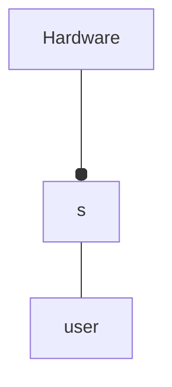
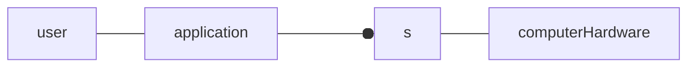
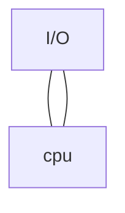
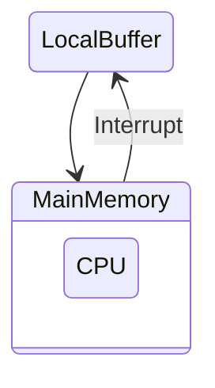
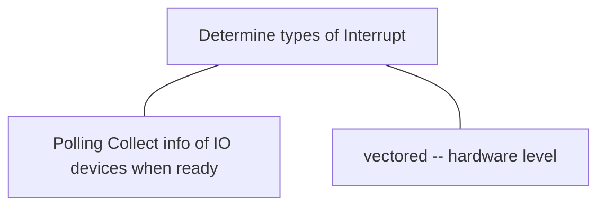
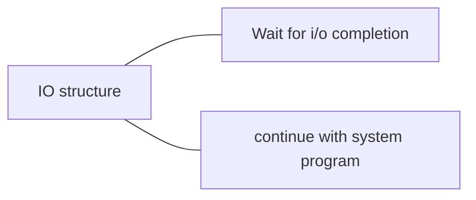
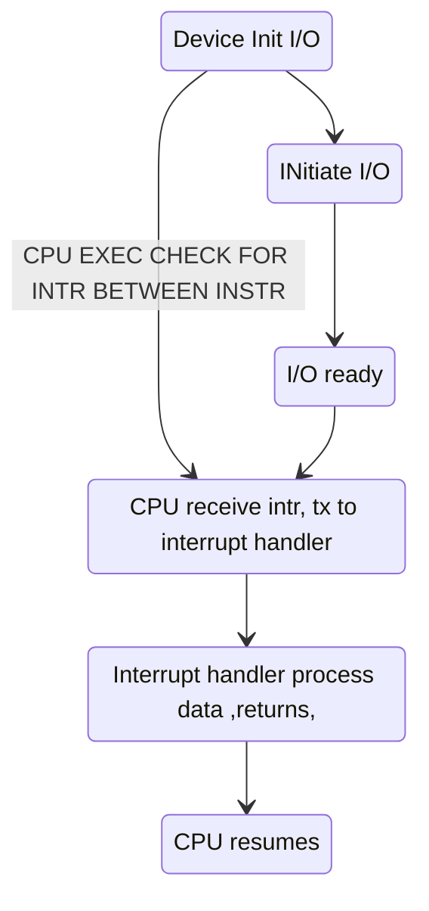
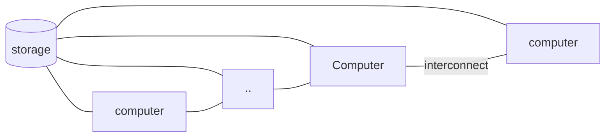
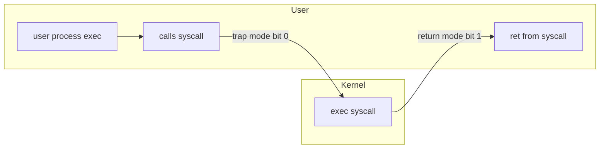

# L1

OS - set/ suite of tools that allow the function of a computer system

bootstrap program

- loaded during power on
- on ROM EPROM
- aka firmware

- Interrupt --> InterruptVector Table

| 1   | 0x000...   |
| --- | ---------- |
| 2   | addr (ISR) |
| 3   | addr       |
| 4   |  ..        |
| 5   |  ..        |

- Interrupt Chaining (Vectortable points to handlers, all are executed till right one happens) -- tradeoff with speed

- Incoming interrupt is disabled when handling other interrupt to prevent lost interrupt
- Trap interrupt -> software interrupt

Interrupt handling

- preserve CPU state

Device Status Table

- Maintains Type, state etc. for Each I/O device

## Von Neumann architecture

## Symmetric multiprocessing

## Clustered computing

- Memory shared by a san (storage area network)
- High availability
- symmetric / asymmetric clusterprocessing available

# OS structure

- Multiprogramming -- Single user can't keep CPU / I/O devices busy at all times
  - aka job scheduler
- Timesharing
  - multitasking aka cpu scheduling

Software error or req creates exception on trap

# 2 modes : User or Kernel

