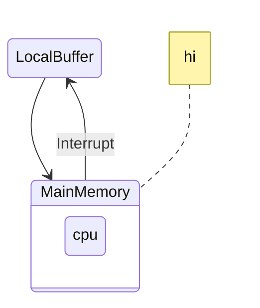
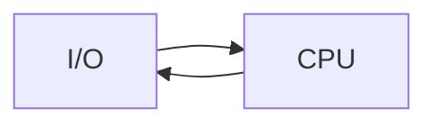

# Operating systems L2

## 3. Protection and security

- protection mechanism for controlling access
- security: defense against internal and external attacks

- User mode, kernel mode

  - Kernel mode has a higher privilege.
  - Privilege escalation

    - You can give additional permissions to the user

## 4. Virtualization

- Make limited resources available to multiple programs
- not to be confused with emulation - anything treated as a single entity, can be accessed by many user. Eg. VirtualBox, kernel virutalmachines
  - Host OS, on top of which Virtual machines run Virtual machines with OSs called Guest OSs.

## 5. Distributed Systems

- Network Operating systems
  - Client-Server architecture usedetc.
  - Peer - to - Peer , all usershave same signifance
  - Cloud computing
- Software as a service (SAaS)(google), Platform As a service (PAaS)(amazon)

## Web based systems

- Load Balancers

## Doubts

1. How frequently should we clear the cache?

   > Cache is smaller in size than main memory, so we need to selectively map main memory to cache, so we need to clear it multiple circumstaces.
   >
   > - eg. cache is full would mean that you need to clear it. THis is performed by cache algorithms such as cache block algorithms

2. What is an example of spooling?

   > Multiple tasks can be gathered and executed in a certain order, based on the scheduling algorithms

3. Could you please explain privilege escalation?

   > generally done by an attacker e.g. execute a file given only read access, by using some unfair means.

   > Preventing this is the major jobs of the OS.

4. With regards to cache coherency why would the value of an integer vary between different caches?

   > each processor is having its own cache.
   >
   > - a bigger problem is sliced into smaller problems for each problems
   > - multiple processes might access the same memory,
   > - so depending on the cache, it views the memory differently, so you need coherence.

5. How does the OS verify if the cache is valid?

   > Later studied, there's a valid bit preserved in the data, by looking at the "valid bit".  
   > 1 - valid  
   > 0 - invalid

6. What's the difference between multithreading and multiprocessing?

   > 1. if we are greedy for performance and we want to slice the process into several finer execution units, we make it multithreading
   > 2. Multiprocessing is more hardware-oriented, if the architecture has more processors

7. Are P2P systems fully interconnected
   > Nah

## Quiz

1. c) kernel
2. d) middleware
3. c) interrupt
4. b) Systemcall
5. a) ROM
6. c) Caching
7. a) DMA
8. c) virtual memory - processes not completely in memory
9. a) 1
10. d) Firm RTOS

# New heading

SImple and sound don't autoscroll please

Trying to autoscroll is a major headache with this so pls don't
