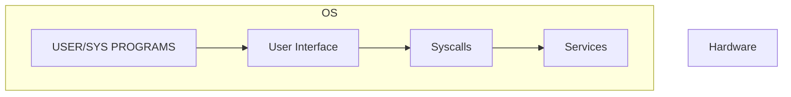
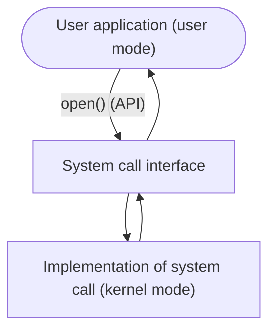

# L3 OS

(Really nothing much to note down)

## Resource sharing
  - Responsibility of OS to provide a smooth allocation of resources to allow execution
  - Logs have all the details of resources -- maintaining the logs is another responsibility
## Protection and security  
  - Forms another responsibility -- User/Kernel mode

## View Of OS 

CLI - Command Line interface - direct commands 
Some programs also act as CLIs

## Shell
Bourne shell -- Default prompt `$`
C-shell -- Default prompt `%`
terminal / shell
| terminal | shell |
| ----| --- | 
| it just is an env for Command Line  | environment for CL interpreter, provides programming |

## GUI 
UI isn't a necessity for an OS, some are on CLI
User Operating SYstem Interface - 
  - Desktop is a metaphor interface
    - Invented at Xerox PARC
    - Windows is GUI with CLI "command" shell
    - Apple MacOSX is "Aqua", with UNIX kernel  and available shells 
    - Linux / Unix have kernel and several  Destkop Environments (Gnome, KDE, X)

  - Touchscreen interfaces 

## System calls
- Programming interface to the services provided by the OS
- Written in C/C++
- Mostly high level API used
    - eg. Win32API for windows
    - POSIX API
    - Java API

## Example

### Example of a Syscall
`sys_write`
  - Every system call is identifiable by a unique value
### Example of an API
`ssize_t read(int fd, void *buf, size_t count)`
  - the man page helps
  - API hides most of the OS interface

### Types of Syscall
  - read slides -_-
  1. Process control
  2. File Management
  3. Device Management
      - Requesting / Releasing device (eg. int 13h)
  4. Protection and Security
  5. Information maintenance
      - Get date time
  6. Communication
      - message passing and shit
  
  Reference: 
  

### Flow diagram

## System Call Parameter Passing

NOTE: System calls are executed in kernel mode, not the user mode.

- Three popular techniques
    1. Registers (simplest, and since CPUs have fast access)
      - Sometimes more params than registers 
    2. Pass in a block or table
      - parameters are stored, block address in register
    3. Stack (Linux , Solaris)
      - params Pushed into stack
      - popped off the stack by the OS
    
## Quiz
1) b)
2) a) tcsh - cshell
3) b) number
4) c) main memory, but she said the params are actually in a) registers (when they are ACTUALLY in main memory no?)
**Clarity**: 
it's a pass-by-value, so the parameters are in fact in registers
5) b)
6) c)
  

