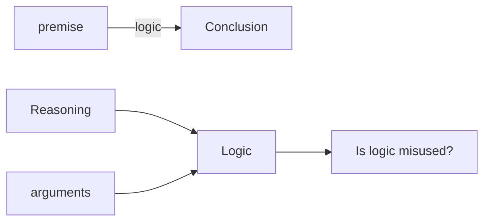

# L3

First 15 minutes please
  - Recap apparently, lite stuff

### Is thinking logic?
  - Thinking also involves recalling, imagining, assumption, hating, loving etc.

### Is logic Reasoning? What is reasoning? What is reason?
  > - Reason= The ability to arrive at a conclusion given the premises
  > - Logic= Relationship between the conclusion and premises

> - Reasoning = Using the ability/reason to arrive at the conclusion
> - Logic = Is your reasoning correct or not?

### Although not technically correct
  - Can something be rational yet, illogical? And irrational yet logical
    Eg. Books of law: Any kind of murder with malicious intent, not out of self defence should be punishable with death
    Now if a 5 year old did it? Logically yes, Rationally naaah
  - Intuition opposite of tuition: a hunch we don't learn

## What do we need logic for?
 - Given information aka premise --> Conclusion

 - Logic lets us test if the conclusion that we arrived with premises, was correct or not.
    - the whole process is called argumentation

# $$* End*$$

## Questions after the slides were over

1. If we arrive at a conclusion given the premise and the premise in itself is false. Would the conclusion be logical?
    - Yes. This will however be dealt more in detail in the class where we deal with soundness

2. Is it true that we can assume any given premise as true for the purpose of logical proof?
    - Yes. we can assume statements to be true. And then it will be logical if from the premise we can reach the conclusion
    - The truth values are determined from the environment, i.e. the world

3. what if a person kills a man who molested his son and killed him.
is this irrational and logical?
    - My example was entirely made up. I am not a legal expert. So, please do not rely on my example for the real world scenario.

    - Murder is not punishable by death in first world countries. In fact, murder itself is a vague term.
They use various varieties of terms like
Homicide, culpable man slaughter, etc.
Assassination, murder, killing, etc.
    
    - When many people are killed, it is called genocide. 
Based on the premise, i.e. the law, and the situation/case on hand, you can arrive at a conclusion/punishment. 

    - Whether this whole process was correct or not, that is logic.

-   - Premise: All Xs are Y. John is an X.
    - Conclusion: Therefore, John is also a Y.
    - It does not matter what X and Y completely is, for logic. 

