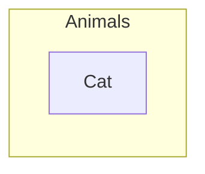

# L8

Proposition in traditional logic

Universe has thing/objects
things have attributes
A thing may have more than one attribute
it is easy for us if we classify objects into categories

What is a class
  - A collection of things that have some attribute in common
  - Some defns may call them the 'set of things' or 'category of things'/
  - Some defns may use 'attribute' and 'property' interchangeably
    - depends on the school of thought
    - Physics is factual so not many schools of thought, but philosophy has many

## Define a class

- extension
- intention

- The richer the intensional definition, lesser (or similar) the membership of extension
  - Men  - 50% of people
  - Men with blue hair and yellow eyes - 0% population
  - Sometimes the numbers stay, and may not decrease when you add attribute
  - NaMo and Rahul Gandhi are both men and political figures

- Knowing the extensional members does not guarantee knowing the intensional definition

- Classes have relationships with each other

some classes may be partially within others
some classes may be completely different

Categorical propositions
  - Deductive arguments are made up of proposition, what are they?
   - Propositions in a deductive argument are of the type
Subject-Predicate

We need to take the precise categorical propositions from general statements

- Validity:
  - checking if the statement about the class membership are valid or not
  - Checking if the membership established in the conclusion (TF Socrates is a mortal) really follows from the membership established in the premises (All men are mortal. Socrates is a man.)

- theory of deductio: on basis of categorical proposition; on the membership of classes
  
